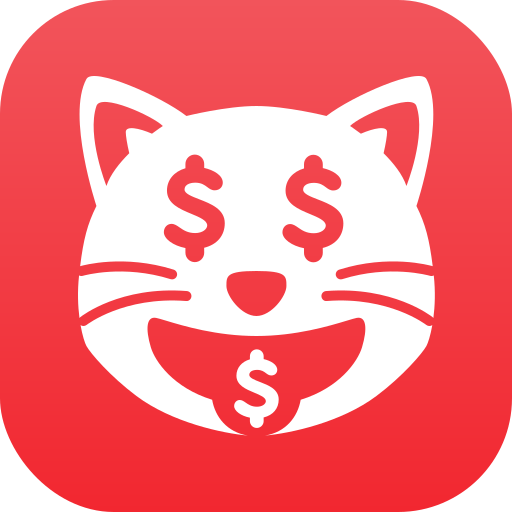
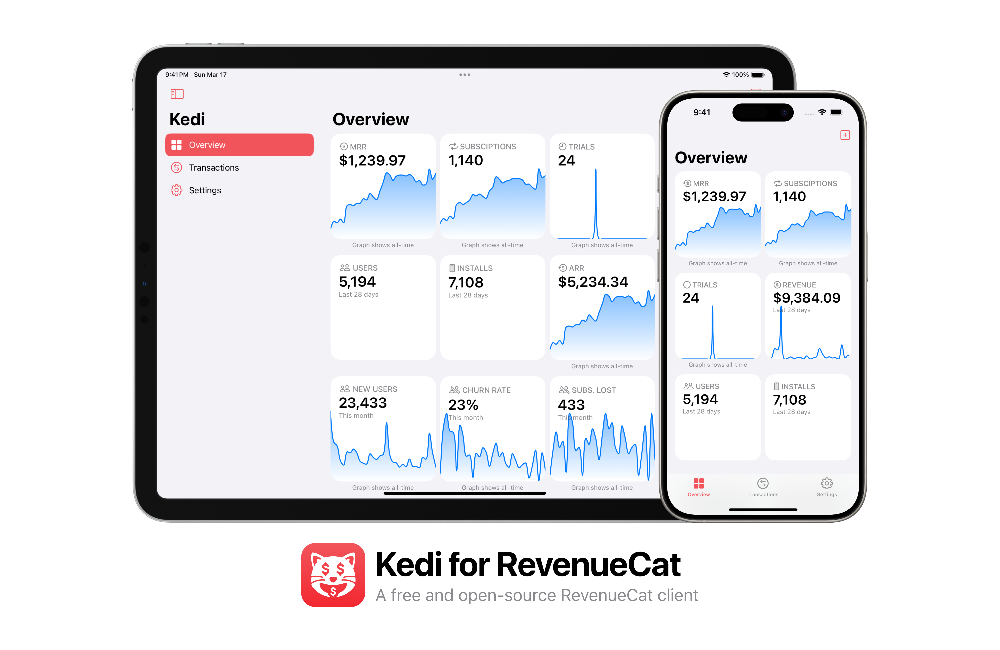
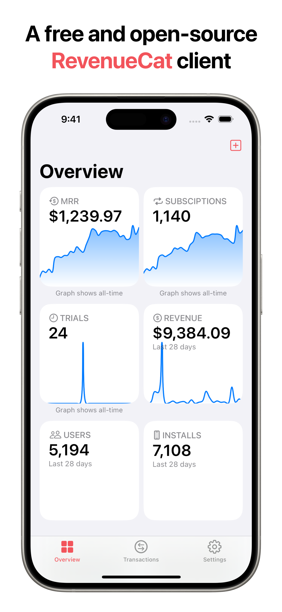
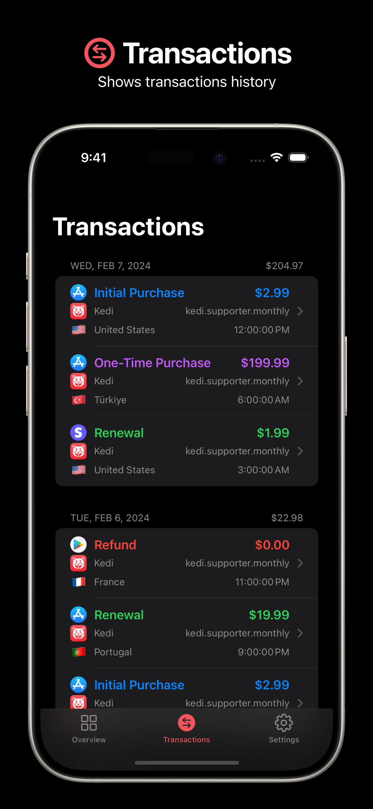
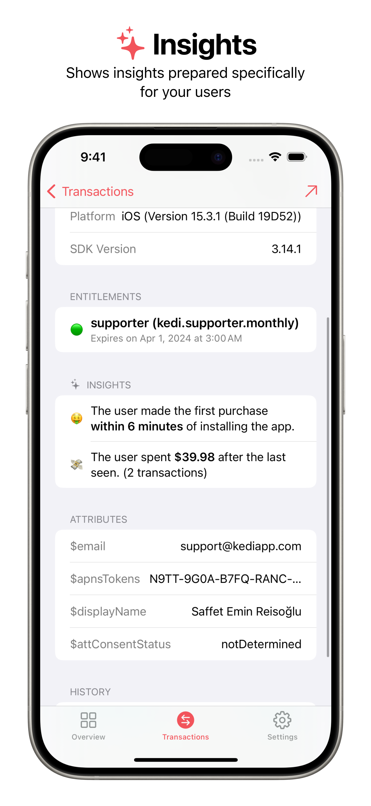
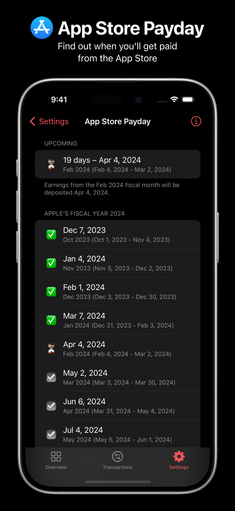
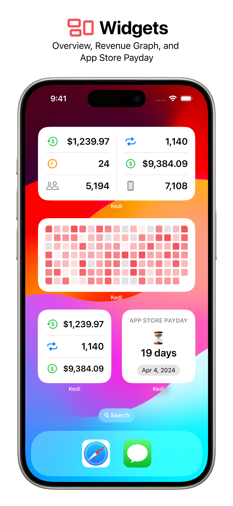
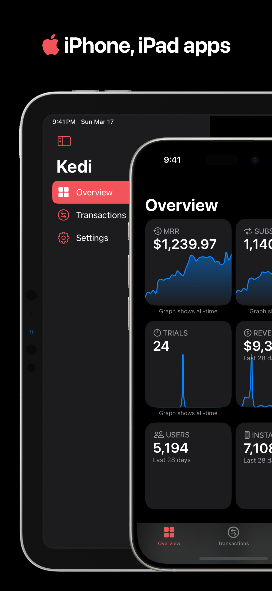

  
  <h1 align="center">Kedi for RevenueCat</h1>

  

  

A free and open-source RevenueCat client.

## Screenshots

|  |  |  |
|-|-|-|

|  |  |  |
|-|-|-|

## App Icon

App icon created by [Saffet Emin Reisoğlu](https://twitter.com/sereisoglu) using [Twemoji](https://github.com/twitter/twemoji).

## Compatibility

Requires iOS 17.0 or later. Compatible with iPhone and iPad.

## Third Party Dependencies

- [Alamofire](https://github.com/Alamofire/Alamofire)
- [Cache](https://github.com/hyperoslo/Cache)
- [KeychainSwift](https://github.com/evgenyneu/keychain-swift)
- [OneSignal-XCFramework](https://github.com/OneSignal/OneSignal-XCFramework)
- [RevenueCat](https://github.com/RevenueCat/purchases-ios)
- [TelemetryClient](https://github.com/TelemetryDeck/SwiftClient)

## License

This project is licensed under the GNU General Public License v3.0 - see the [LICENSE](LICENSE) file for details.
